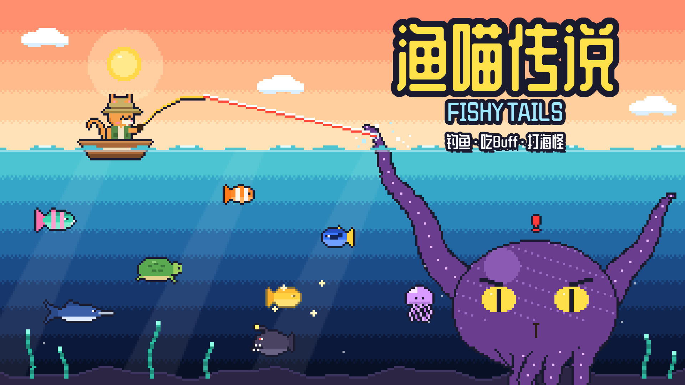

# 渔喵传说 Fishy Tails

竖屏像素风钓鱼小游戏：一只戴渔夫帽的猫，从阳光浅滩一路钓到海底龙宫，最后和海龙王拔河。

**在线试玩：** https://grrreymane.github.io/FishyTails/

## 怎么玩

- **点击**抛竿，鱼咬钩出现 **!** 时**按住**
- **按住收线**，鱼头上出现红色 **!**、鱼线变红时**松手**
- 乱按会拉扯鱼线，断线扣一颗心

## 玩法

- **九片海域**：阳光浅滩 → 彩虹珊瑚礁 → 冰封海湾 → 沉船墓场 → 熔岩热泉 → 无光深渊 → 失落遗迹 → 星光海 → 龙宫
- **一鱼一 Buff**：每种鱼钓上来都会给一个效果（收线更快、断线护盾、放电麻痹……），一局内叠加
- **海怪 Boss**：每片海域钓满 4 条鱼后登场，各有机制（河豚鼓刺、乌贼喷墨、幽灵鲨隐身、守护者石化、星鲸涨潮、海龙王三阶段喷发……）
- **闪光鱼**：稀有金色变种，5 倍金币、双倍 Buff
- **特别花色**：普通鱼偶尔带有奶油、薄荷或星点花色，收集后自动在小馆展示；没买鱼缸也有免费的旅行小鱼缸。只改变外观，金币、Buff 和钓鱼操作不变；最多 12 次符合条件的捕获必出一次花色，同种鱼优先发现未收集花色。
- **海边小礼物**：钓鱼偶尔顺带捞到贝壳风铃、漂流瓶等 9 件摆件，自动摆上小馆墙架。随海域进度解锁可发现的物件，优先给未拥有的摆件；首件最多 4 次、之后最多 14 次有可发现摆件的捕获必得，不用兑换或交任务。
- **尺寸冠**：钓到特别大的鱼拿大金冠、银冠，特别小的拿小金冠
- **鱼类图鉴**：记录每种鱼的尺寸范围、捕获次数和冠
- **商店**：金币存进钱包，在标题画面买帽子、鱼竿、船和猫猫花色，每件都有小加成
- **随手逛逛**：钓鱼画面右侧可直接打开商店；右上角小房子菜单里可进入图鉴或「回小馆」，关闭后继续原来的钓鱼进度。
- **渔喵小馆**：从小房子菜单「回小馆」休息，再点「出海」接着钓。鱼获自动做成料理，出海时也继续营业；回馆自动收取营业款，最新料理、海怪招牌、新摆件和新客人会带来不同的欢迎消息。茶点每 5 分钟积累 2 营业款，空店离线 8 小时约 192；离线最多结算 8 小时。普通鱼料理基础售价最低 5，小鱼缸售价 800。默认每 45 秒售出一份鱼料理，座位提高速度，厨具提高售价。魅力吸引串门小动物，不再加快售菜；访客不占座、不消耗食材，也不产生额外收益。
- **两份收入，各有用途**：钓鱼金币买帽子、鱼竿、船和花色，本局钓获金币继续用于分享成绩；小馆营业款与客人小费专门买墙纸、地板、灯具、植物、鱼缸、座位、厨具、地毯、露台和摆件，共 37 件付费装修。装修可以分页浏览、点击名称预览实际摆放效果。旧存档的金币、装修和图鉴都会保留，不需要兑换货币。
- **温馨小馆**：吃过鱼料理的客人冒出爱心，点击聊天并收小费，不点也不影响正常营业；茶点客人不额外产出小费。鱼缸可以挑选已经收集的鱼，闪光鱼和海怪幼崽也能展示；招待客人和放生海龟涨人气，人气升级会迎来企鹅、海獭、海豹、章鱼客人。
- **图鉴奖励**：集齐一片海域的鱼和海怪，小馆展示架上多一件主题摆件（魅力 +3）
- 断光线后可以**从当前海域继续**

## 本地运行

整个游戏是一个 `index.html`，没有构建步骤，直接用浏览器打开即可。图鉴和最高纪录保存在浏览器本地存储里。

字体使用本地 Fusion Pixel 12px 简体中文子集，许可见 `fonts/OFL-fusion-pixel.txt`。更新文字后运行 `python tools/subset_font.py`（依赖上层 Minigame 工作区的字体工具和原字体，不联网）。
